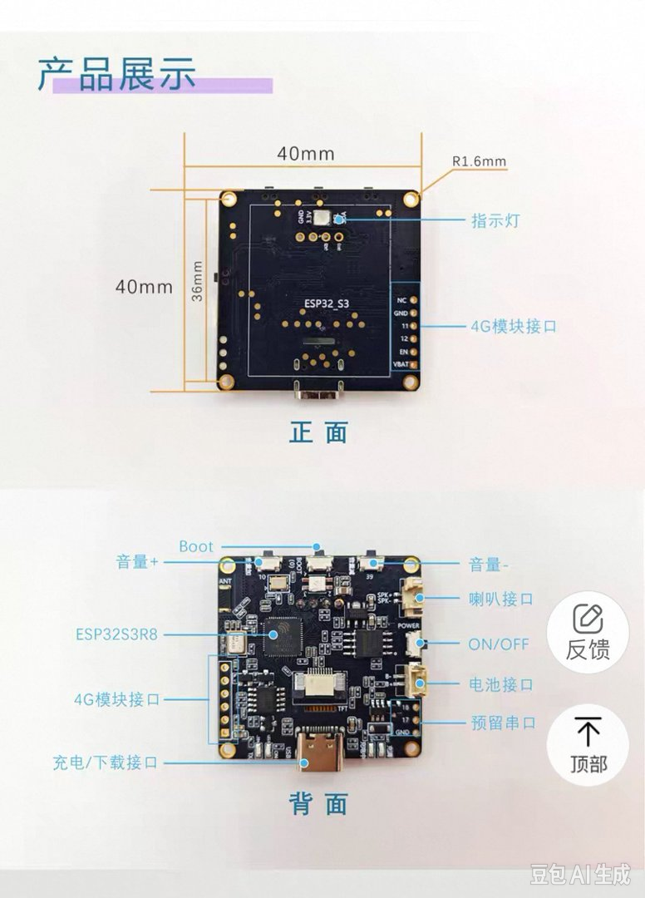

(English | [中文](README_zh.md))

# xiaozhi-esp32 Custom Build · Xiaozhi AI + Noirix44 Keyboard Monitor (1.54TFT)

A customized firmware based on [xiaozhi-esp32](https://github.com/78/xiaozhi-esp32). It keeps all Xiaozhi AI features and adds three capabilities:

- **Noirix44 keyboard status monitoring**: BLE broadcast → on-screen WPM, layer name, modifiers, battery
- **First-boot language selection**: 6 languages, confirmed with the Boot key
- **Dual always-on wake words**: Chinese 「你好小智」 + English 「Hi ESP」

---

## Hardware



| Part | Spec |
|---|---|
| MCU | ESP32-S3 (8MB Flash / 8MB PSRAM) |
| Display | 1.54" TFT square screen (ST7789, 240×240, no touch) |
| Audio | I2S digital microphone + speaker |
| Buttons | Boot (GPIO0), Vol+ (GPIO10), Vol− (GPIO39) |

---

## Features

### 1. Xiaozhi AI (full upstream capabilities)

Voice chat, network provisioning, OTA upgrade, MCP tools — identical to upstream, nothing removed.

### 2. Keyboard status monitoring

Works in BLE observer mode: no connection is established, no keyboard connection slot is occupied.

**Screen layout (240×240):**

| Area | Content |
|---|---|
| Top | USB / BLE connection status (the active one lights up) |
| Upper | WPM live line chart (last ~30 s, Y-axis capped at 150, no axis ticks) |
| Middle | Layer name in large text (60 px bold, auto-shrinks to 48/36 px when too wide) |
| Middle-lower | 4 modifier chips: CTRL / SHIFT / ALT / GUI (highlighted when pressed) |
| Bottom | L / M / R battery bars for three devices (>30% green, 10–30% yellow, ≤10% red) |

**Protocol**: Prospector v2.2 — the keyboard side must run the `monitor` branch of `zmk-config-Noirix44`, broadcasting a 26-byte manufacturer payload (FF FF header + AB CD protocol ID + channel + layer name + modifiers + WPM + three battery levels, etc.).

**Optional one-to-one monitoring:**

- `CONFIG_KEYBOARD_MONITOR_TARGET_MAC`: bind the keyboard MAC; only that keyboard is shown
- `CONFIG_KEYBOARD_MONITOR_TARGET_ID`: bind the keyboard hardware ID (HWINFO, 8 hex chars) for stronger identity check
- `CONFIG_KEYBOARD_MONITOR_CHANNEL`: channel filter (enabled by default)
- If all three are left empty, only channel filtering applies; keyboards on the same channel will be mixed together

**Scan strategy**: the BLE stack is ready at boot (always on, radio idle); **scanning starts only when the monitor screen is open**. On sleep, scanning stops and the monitor screen hides automatically; on wake, it resumes.

### 3. First-boot language selection

| Language | Display name |
|---|---|
| Simplified Chinese | Chinese |
| Filipino | Filipino |
| Vietnamese | Vietnamese |
| Korean | Korean |
| Malay | Malay |
| English | English |

- Appears automatically only on first boot (no language record in storage); the screen **never times out**
- **Vol+ moves down, Vol− moves up** (cyclic), **Boot confirms**
- Each switch plays a voice prompt in that language: 「Press Boot to confirm」
- After confirmation the choice is saved and takes effect immediately; later boots enter the selected language directly
- While the language-selection screen is active, the volume keys are temporarily repurposed for switching languages

> Note: language selection only switches the **on-device UI language**. Voice conversation still follows the upstream mechanism — for actual voice interaction you configure the matching voice package in the Xiaozhi console. Also, official wake-word models only cover zh/en/ja/fr/de/es/it — **ko/vi/ms/fil have no official wake-word model** (UI translation is unaffected).

### 4. Dual wake words

Two wake-word models are always resident after boot:

- Chinese: 「你好小智」
- English: 「Hi ESP」

---

## Basic operations

| Action | Key / phrase | Description |
|---|---|---|
| Volume | Single-click Vol+ / Vol− | ±10% each step |
| Max volume | Long-press Vol+ | straight to 100% |
| Mute | Long-press Vol− | straight to 0% |
| Open keyboard monitor | Double-click Vol+ | or say 「打开键盘监控」/「查看键盘状态」 |
| Close keyboard monitor | Double-click Vol+ / voice close | or wait for auto-return (30 s without keyboard data, configurable) |
| Wake & chat | Say 「你好小智」 / 「Hi ESP」 | |
| Network provisioning | Connect phone to the device hotspot, follow the Xiaozhi console | same as upstream |

While the monitor screen is open, single/long-press volume keys still work normally.

---

## Keyboard side preparation

1. Flash the keyboard with the `monitor` branch of `zmk-config-Noirix44` (enables Prospector v2.2 broadcasting)
2. Optional — configure in `idf.py menuconfig` → board options:
   - `CONFIG_KEYBOARD_MONITOR_TARGET_MAC` (keyboard MAC)
   - `CONFIG_KEYBOARD_MONITOR_TARGET_ID` (keyboard HWINFO, 8 hex chars)
   - `CONFIG_KEYBOARD_MONITOR_TIMEOUT_SEC` (auto-return seconds, default 30)
   - `CONFIG_KEYBOARD_MONITOR_CHANNEL` (must match the keyboard side)

---

## Build & flash

### GitHub Actions (recommended)

- Pushing the `ci/st7789-1.54-tft` branch triggers the build automatically
- Changes under the board directory (`main/boards/zhengchen/1.54tft-wifi/`) build the zhengchen board; changes to shared files build the representative boards only
- You can also run the workflow manually from the Actions page (full build)
- Firmware artifacts are downloaded from the build Artifacts

### Local build

```bash
idf.py set-target esp32s3
idf.py menuconfig
# Xiaozhi Assistant → Board Type → zhengchen-1.54tft-wifi
idf.py build
idf.py -p <serial port> flash monitor
```

Flash tip: if startup misbehaves after an upgrade, try flashing **without erasing** the device (keep calibration/NVS data).

---

## Directory structure (relevant parts)

```
main/boards/zhengchen/1.54tft-wifi/
├── zhengchen-1.54tft-wifi.cc    # board init: buttons, display, monitor/language-select wiring
├── monitor_screen.{h,cc}        # monitor screen layout and refresh
├── keyboard_monitor.{h,cc}      # BLE scanning, Prospector v2.2 parsing, on-demand scanning
├── language_select.{h,cc}       # first-boot language selection
├── config.h / config.json       # pin definitions / CI build config
└── lv_font_montserrat_bold_*.c  # generated bold fonts for the layer name
scripts/gen_lang.py              # runtime multi-language header generator
```

---

## FAQ

**Q: How do I get the language-selection screen back?**
Erase the device NVS (check "erase flash" when flashing, or factory reset).

**Q: White screen / repeated reboot at startup?**
Check the serial log first. Common cause: calibration data was erased while flashing. Reflashing **without erasing** usually restores it; make sure the log does not show a repeated `Factory partition not found`.

**Q: No keyboard data on the monitor screen?**
1. Make sure the keyboard runs the monitor-branch firmware (v2.2 broadcast)
2. Make sure the channel matches the keyboard side
3. If MAC / HWINFO binding is configured, verify it matches the actual keyboard
4. Open the monitor screen first (BLE lights up at the top) and observe

**Q: What if multiple keyboards broadcast at the same time?**
Without one-to-one binding, channel filtering applies and keyboards on the same channel mix together; after configuring MAC or HWINFO binding, only the bound keyboard is shown.

---

## License

Follows the upstream open-source license of [xiaozhi-esp32](https://github.com/78/xiaozhi-esp32).
